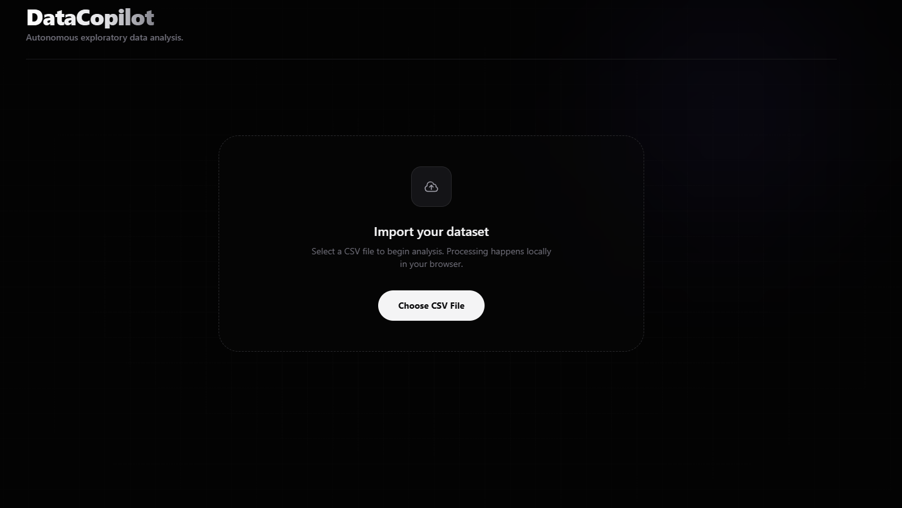
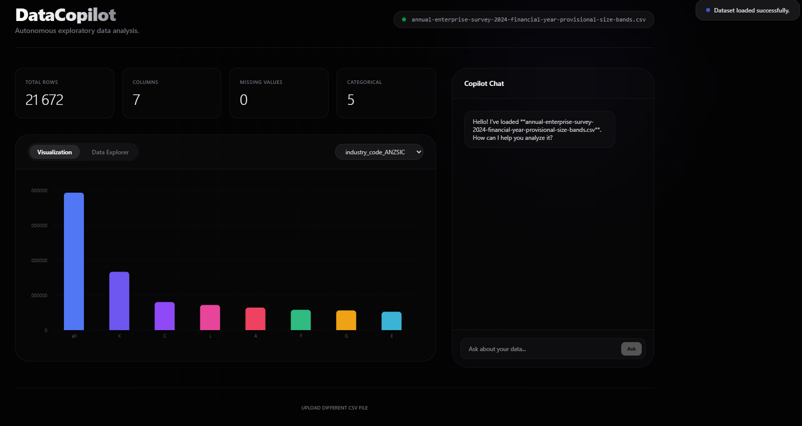
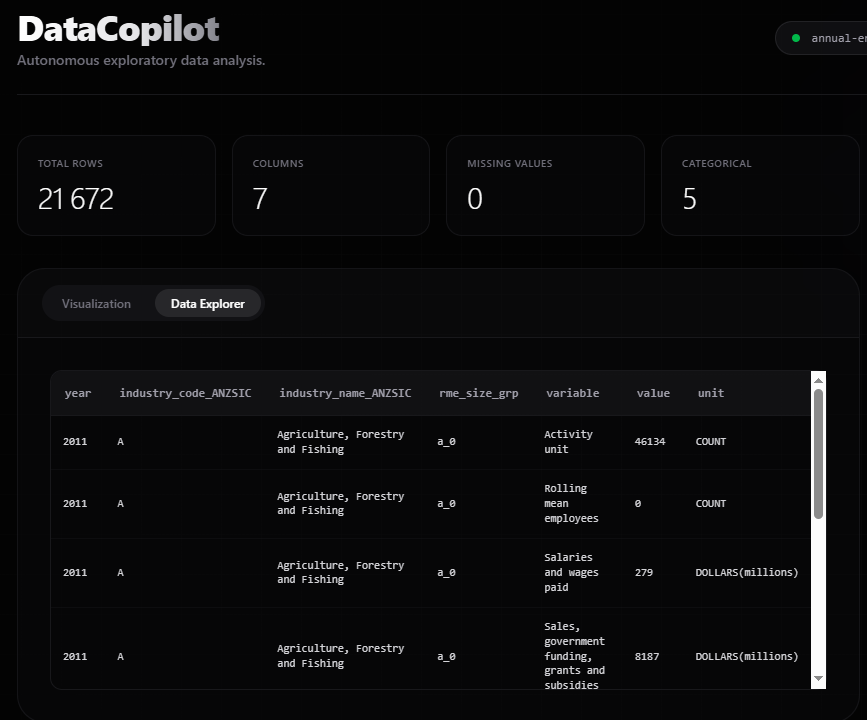
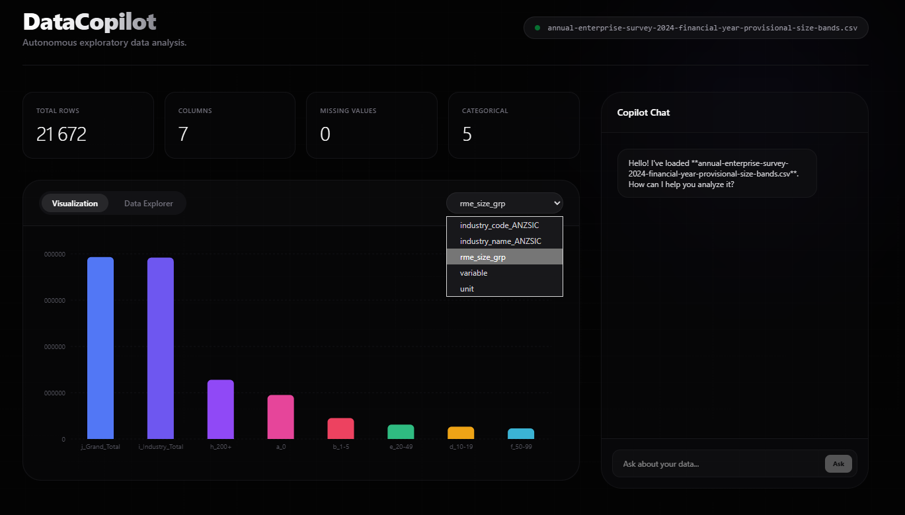
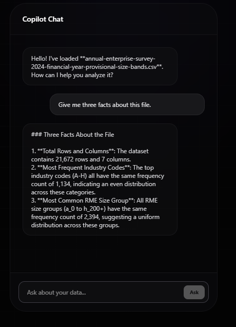
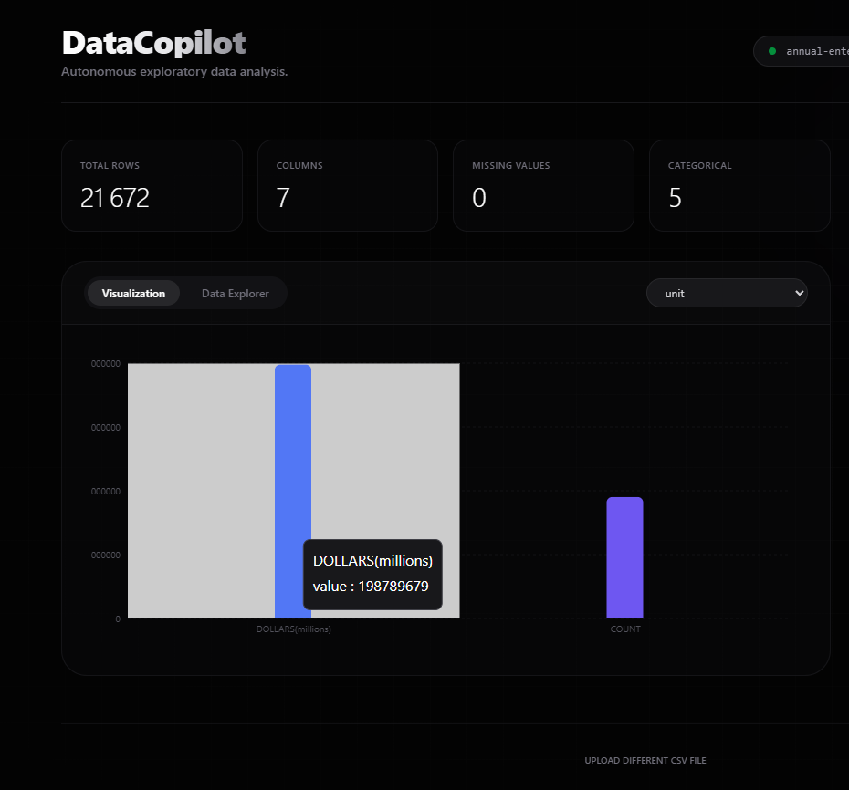
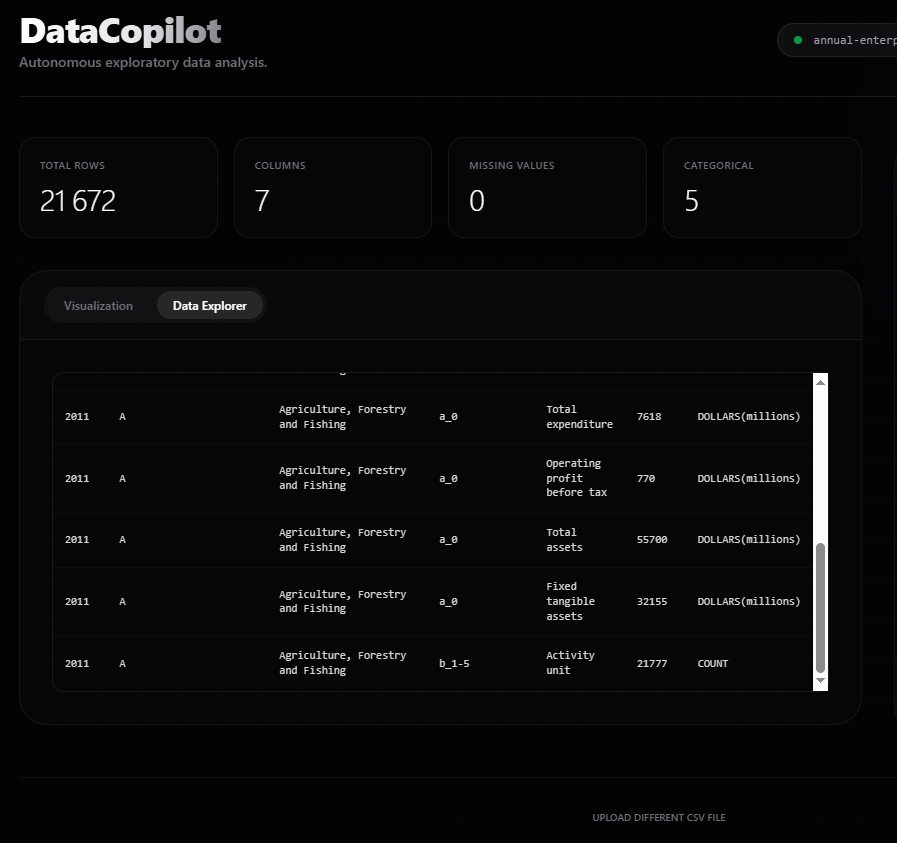

## DataCopilot Dashboard (pictures end of the page)

DataCopilot is an AI-powered dashboard for exploring CSV datasets.
Upload any CSV file and the app automatically generates:

A dataset summary (rows, columns, types, missing values)

Column-level profiling

Category distribution visualization

First-row preview

AI-generated insights using Groq LLM

Natural-language Q&A (Ask your data)

Built with Next.js, TypeScript, PapaParse, Recharts, and Groq API.

## Features

- CSV Upload – instantly parse and inspect datasets

- Automatic Analysis – detect column types & missing values

- Charts – view category frequency distributions

- AI Insights – overview, key findings, recommendations

- Ask Your Data – ask questions in English and receive AI interpretations

- Modern UI – dark theme, responsive layout

## Tech

- Next.js (App Router)

- TypeScript

- PapaParse

- Recharts

- Tailwind CSS

- Groq LLM API

## Purpose?

A practical demonstration of:

- LLM-assisted data analysis

- Automated EDA tooling

- Full-stack TypeScript/Next.js development

- Real-world CSV parsing + visualization

# Image 1 – Dataset summary + AI button

User uploads a CSV → App computes basic stats (rows, columns, types, missing values).
“Generate AI insights” button will send this metadata to Groq for analysis.

# Image 2 – AI insights shown

AI request completed.
Groq returns three sections: Overview, Key findings, Recommendations.
Frontend renders them under “AI insights”.

# Image 3 – Category distribution chart
User selects a column → The app draws a bar chart of value counts using Chart.js.

# Image 4 – AI insights (scrolled view)
Just a lower view of the same AI output.

# Columns + CSV preview
App detects column types + missing values and displays first rows of the CSV for verification.

