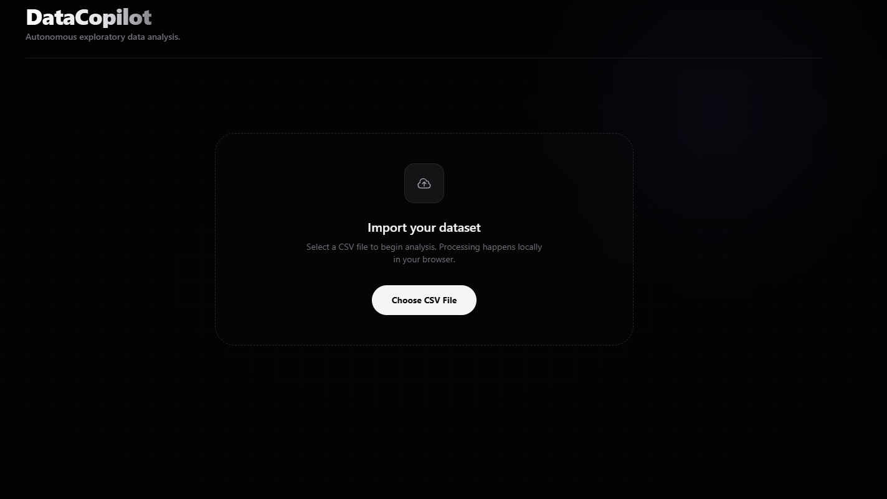
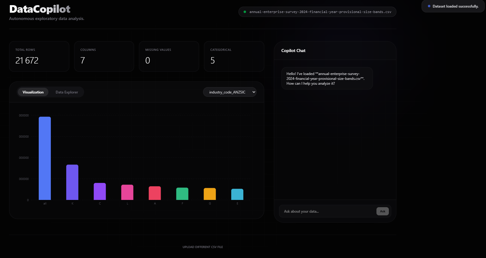
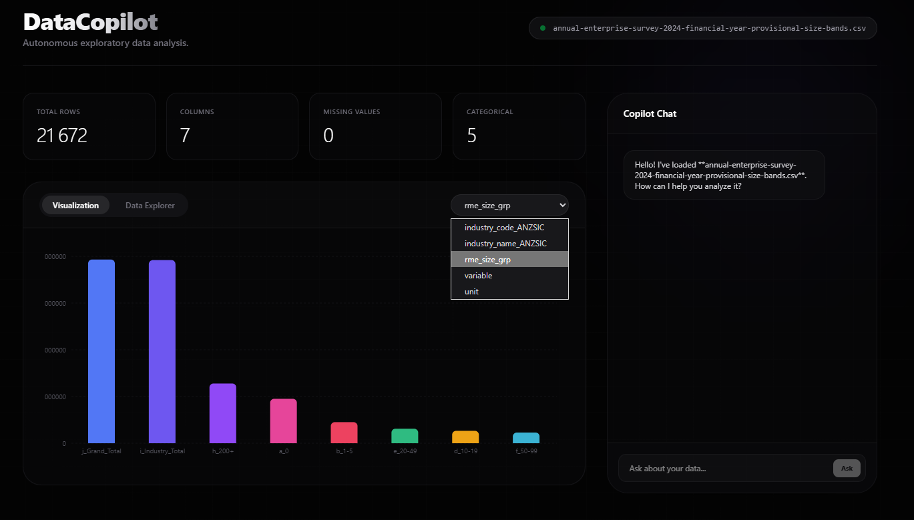
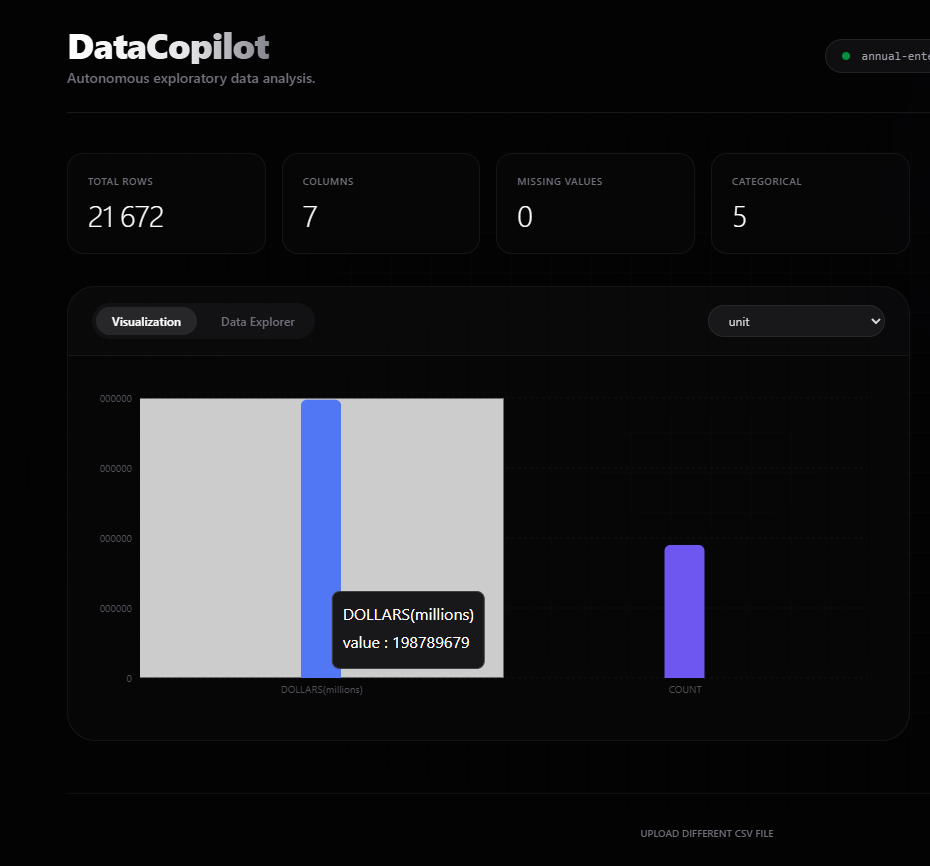
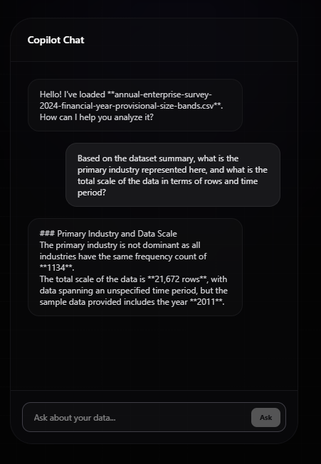
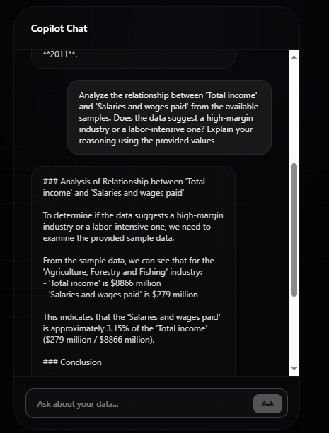
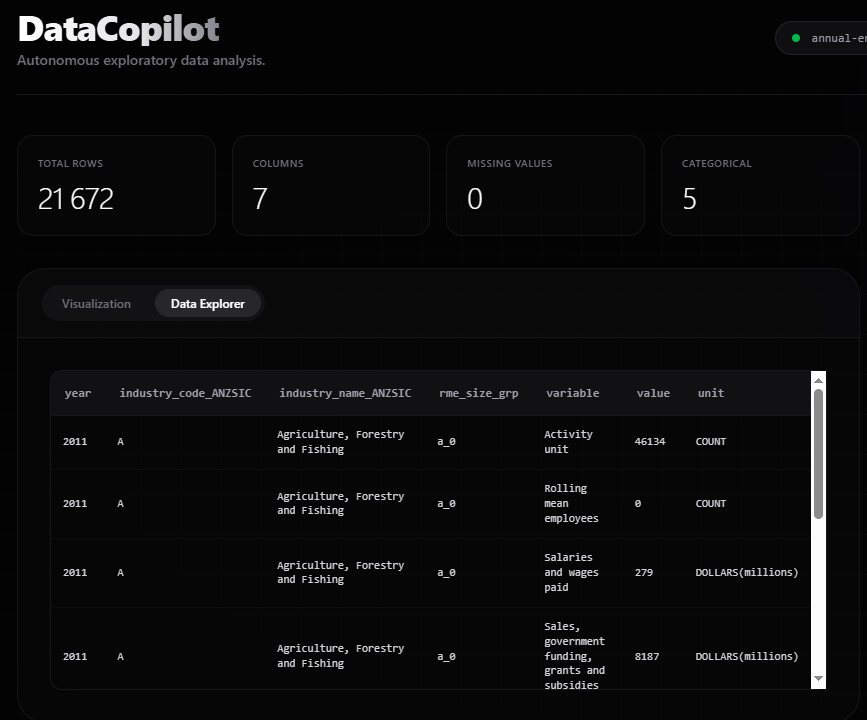
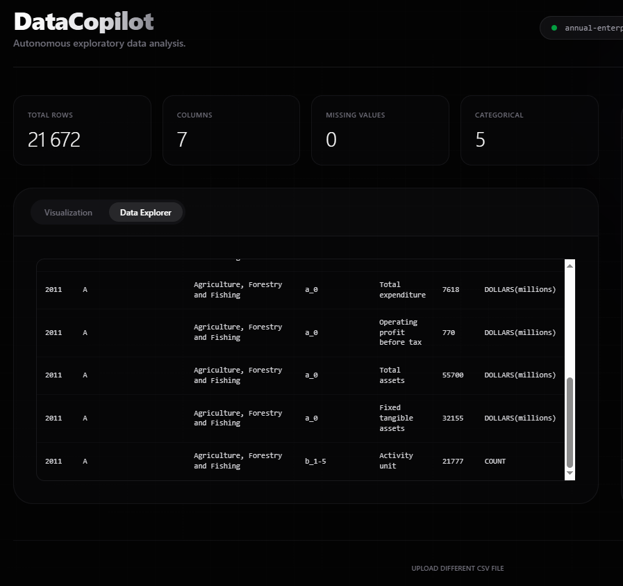

# DataCopilot

DataCopilot is a local-first, AI-powered exploratory data analysis (EDA) dashboard. It bridges the gap between raw CSV files and actionable insights by combining robust client-side data processing with the analytical capabilities of the Groq Llama 3 LLM.

![Dashboard Preview]

## Core Features & Functionality

DataCopilot is designed to automate the most time-consuming parts of data analysis. Here is what the application does when you interact with it:

### 1. Automated Data Profiling
When a user drops a CSV file into the application, it is immediately parsed locally in the browser using PapaParse. The system scans the dataset to detect the schema, identify column data types (strings, numbers, dates), calculate total row counts, and locate missing values. This ensures data privacy, as raw data never leaves the client during the parsing phase.

### 2. Dynamic Visualizations
Instead of staring at a wall of numbers, users can select any column from the parsed dataset. The application automatically aggregates the data, calculates sums or value frequencies, and renders interactive bar charts using Recharts. This allows users to spot trends, largest expenses, or category distributions at a glance.

### 3. AI-Assisted Analysis (Copilot Chat)
The dashboard features an integrated natural language interface. Instead of writing SQL queries or Python scripts, users can type questions about their data. DataCopilot securely compiles the dataset's metadata (schema, column summaries, and top-value aggregations) and sends it to the Groq API. The LLM then returns contextual answers, strategic insights, and trend summaries based on the actual numbers.

### 4. Raw Data Explorer
To ensure transparency, the application includes a clean, paginated table view. Users can seamlessly toggle between the visual charts and the raw data explorer to manually verify the parsed information and inspect individual rows.

## Tech Stack

* **Framework:** Next.js 14 (App Router)
* **Language:** TypeScript
* **Styling:** Tailwind CSS (Custom Dark/Glassmorphism theme)
* **Data Parsing:** PapaParse
* **Visualization:** Recharts
* **AI Integration:** Groq Cloud API (Llama 3)

## Visual Tour

**Dataset Overview:** High-level metrics calculated instantly upon file upload.
![Overview Statistics]

**Interactive Charts:** Categorized value aggregates and distributions.
![Visualizations]

**AI Chat Interface:** Conversational data querying with context-aware responses.
![AI Chat Interface]![alt text]

**Data Explorer:** Integrated table inspection for manual validation.
![Data Explorer]

---

### Prerequisites
* Node.js (v18.x or newer)
* A Groq API Key (Obtainable from console.groq.com)